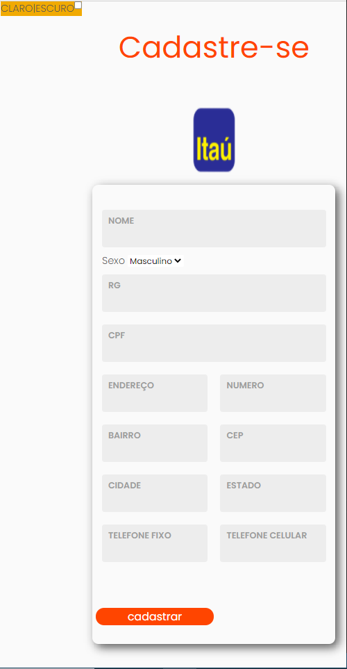

<h1 align="center" >

 Processo Seletivo - Formação Tech

## Desafio Cadastro Pessoal 

Criar um formulario para registrar dados pessoais

  
 
## Orientações 
Cadastro Pessoal com os campos: Nome, Cpf, Rg, Sexo, Endereco, Numero, Bairro, Cidade, Estado, Cep, Telefone Fixo, Telefone Celular.

## Regras de negócio 

 

* Os campos Nome, Cpf, Endereco, Numero, Telefone Celular são obrigatórios

 

##  Extras

* O campo Sexo pode ser do tipo select com com as opções M = Masculino, F = Feminino
* Usar template aplicado nas aulas
* Disponibilizar o link do github do projeto bem descrito quanto às funcionalidades, implementações relevantes e links de pesquisas

 

##  Resultado 
 

### Mobile Version

## Referencias que inspiraram este formulário 

* Formulário com Html e Css [Responsivo] [Ver video](https://www.youtube.com/watch?v=Ph-60-pkAQM) 

 

* Consultar CEP com HTML, CSS e Javascript [Ver video](https://www.youtube.com/watch?v=fxnJffrnrdY)

 
